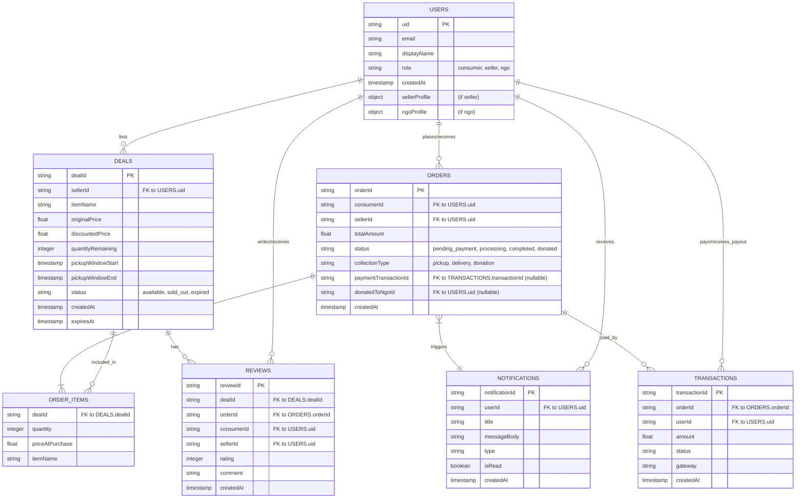

# SharEat Backend Implementation Plan

The goal is to build a robust, scalable, and secure backend that supports all current and near-future functionalities of the SharEat platform, focusing on user roles (Consumer, Seller, NGO), deal management, order processing, donations, and payments.

## 1. Core Entities & Data Models

Based on the frontend components and user flows, the primary data entities for the backend will be:

*   **Users**: Stores information about consumers, sellers, and NGOs. This will extend the current Firebase Auth user data with role-specific profiles and application-specific details.
    *   Key fields: `uid`, `email`, `displayName`, `role` (`consumer`, `seller`, `ngo`), `phoneNumber`, `photoURL`, `createdAt`, `updatedAt`.
    *   Seller-specific: `businessName`, `address`, `location` (GeoPoint), `pickupInstructions`, `isVerified`.
    *   NGO-specific: `ngoName`, `registrationDetails`, `address`, `location` (GeoPoint), `missionStatement`, `isVerified`.
*   **Deals/Listings**: Represents the surplus food items listed by sellers.
    *   Key fields: `dealId`, `sellerId` (ref to User), `sellerName`, `itemName`, `description`, `imageUrls`, `originalPrice`, `discountedPrice`, `quantityInitial`, `quantityRemaining`, `pickupInstructions`, `pickupLocationAddress`, `pickupLocationCoordinates` (GeoPoint), `pickupWindowStart`, `pickupWindowEnd`, `tags`, `status` (`available`, `sold_out`, `expired`, `delisted`), `arEnabled`, `calories`, `serves`, `createdAt`, `updatedAt`, `expiresAt`.
*   **Orders**: Tracks purchases made by consumers or donations.
    *   Key fields: `orderId`, `consumerId` (ref to User), `sellerId` (ref to User), `items` (array of deal details: `dealId`, `itemName`, `quantity`, `pricePerItem`), `subtotalAmount`, `deliveryFee`, `totalAmount`, `status` (`pending_payment`, `processing`, `ready_for_pickup`, `out_for_delivery`, `completed`, `cancelled`, `donated`), `collectionType` (`pickup`, `delivery`, `donation`), `deliveryAddress` (if applicable), `pickupNotes`, `paymentMethod`, `paymentStatus`, `paymentTransactionId`, `donatedToNgoId` (ref to User, if applicable), `createdAt`, `updatedAt`.
*   **Transactions**: Logs payment details, especially for M-PESA.
    *   Key fields: `transactionId` (M-PESA code), `orderId` (ref), `userId` (ref), `amount`, `status` (`initiated`, `success`, `failed`), `gateway` (`mpesa`), `gatewayPayload`, `createdAt`.
*   **Notifications**: For user alerts (e.g., order updates, new deals).
    *   Key fields: `notificationId`, `userId` (ref), `title`, `messageBody`, `type`, `link`, `isRead`, `createdAt`.
*   **(Future) Reviews**: For users to rate deals/sellers.
*   **(Future) NGO Wishlists**: For NGOs to list specific needs.

## 2. Proposed Technology Stack

*   **Database**: **Firestore**. It's already in use for user authentication via Firebase and is well-suited for the application's data structure, real-time needs, and scalability.
*   **Backend Logic**: **Firebase Functions (Cloud Functions for Firebase)**. This allows for serverless architecture, tight integration with Firestore and Firebase Auth, and event-driven capabilities (e.g., triggers on data changes or user creation). Node.js (TypeScript) would be a natural fit.
*   **Payment Integration**: **Safaricom Daraja API** for M-PESA STK push and payment confirmations.
*   **Image Storage**: **Firebase Storage** for deal images.

## 3. Key Backend Modules & API Endpoints (High-Level)

*   **Authentication & User Management:**
    *   Leverage Firebase Auth for sign-up/sign-in.
    *   Firebase Functions to create/update detailed user profiles in Firestore upon new user creation or role selection (e.g., `POST /users/profile`).
    *   Endpoints for users to manage their profiles (e.g., `GET /users/me`, `PUT /users/me`).
*   **Deal Management (for Sellers):**
    *   `POST /deals`: Create a new food listing.
    *   `GET /deals/:dealId`: View a specific listing.
    *   `PUT /deals/:dealId`: Update a listing.
    *   `DELETE /deals/:dealId`: Remove a listing.
    *   `GET /sellers/me/deals`: View all listings by the logged-in seller.
*   **Deal Discovery (for Consumers):**
    *   `GET /deals`: Browse/search all available deals (with filtering, sorting).
*   **Order Processing & Checkout:**
    *   `POST /orders`: Create an order (the core of the checkout `handleConfirm` logic). This will involve:
        *   Validating deal availability.
        *   Updating deal quantities (atomically using Firestore transactions).
        *   Initiating M-PESA payment if selected.
        *   Recording order details.
    *   `GET /orders/me`: View consumer's order history.
    *   `GET /sellers/me/orders`: View seller's received orders.
    *   `PUT /orders/:orderId/status`: Update order status (by seller or system).
*   **Payment Handling:**
    *   `POST /payments/mpesa/initiate`: Trigger M-PESA STK push.
    *   `POST /payments/mpesa/callback`: Secure endpoint for M-PESA to send payment confirmation. This will update the order and transaction status.
*   **Donation Flow:**
    *   Integrated into the `POST /orders` endpoint when `collectionType` is 'donation'.
    *   Logic for matching donations to NGOs (if "auto-match" is chosen) or assigning to a selected NGO.
*   **Notification System:**
    *   Endpoints like `GET /notifications/me`.
    *   Server-side logic (Firebase Functions triggers) to generate notifications for events like new orders, order status changes, payment confirmations, expiring deals, or received donations.

## 4. Database Schema Diagram (Mermaid)

*(Note: `ORDER_ITEMS` would typically be an array of objects embedded within the `ORDERS` document in Firestore for atomicity and ease of querying single orders.)*

## 5. Key Workflows & Logic Considerations

*   **Atomicity in Order Creation**: Firestore transactions are crucial when creating an order to ensure that deal quantities are updated correctly and an order is only created if items are available.
*   **Real-time Updates**: Leveraging Firestore's real-time capabilities for order statuses, deal availability, and notifications.
*   **Security**:
    *   Secure API endpoints using Firebase Auth ID token verification.
    *   Protect sensitive data.
    *   Secure M-PESA callback handling.
*   **Scalability**: Firebase Functions and Firestore are designed for scalability.
*   **Error Handling & Logging**: Robust error handling and logging for all backend operations.
*   **Scheduled Tasks**: Firebase Scheduled Functions for tasks like expiring old deals, sending summary emails, or data cleanup.

## 6. Phased Implementation Approach

1.  **Phase 1 (Core MVP):**
    *   User profile creation in Firestore linked to Firebase Auth (roles: Consumer, Seller).
    *   Seller: Create, Read, Update, Delete (CRUD) for Deals.
    *   Consumer: Browse Deals.
    *   Order Placement: For "Pickup" with "Pay on Pickup" only.
    *   Basic Order Status updates by Seller.
    *   Basic email/in-app notifications for new orders.
2.  **Phase 2 (Payments & Donations):**
    *   M-PESA payment integration (STK Push & Callback).
    *   Full Donation flow (including NGO role, selection, or auto-match).
    *   Enhanced notifications for payment and donation status.
3.  **Phase 3 (Delivery & Enhanced Features):**
    *   "Delivery" option for orders (initially simple, potentially with manual delivery fee calculation).
    *   User Reviews and Ratings system.
    *   More comprehensive notification system.
4.  **Phase 4 (Further Enhancements):**
    *   Admin panel for platform management (user verification, deal moderation).
    *   Advanced search and filtering.
    *   NGO Wishlist feature.
    *   Reporting and analytics for sellers/platform.